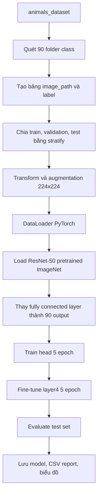

# ResNet-50 Animal Classification

## 1. Mục tiêu của folder này

Folder này chứa toàn bộ notebook, model đã huấn luyện, báo cáo và hình ảnh đánh giá cho hướng **ResNet-50 pretrained** trên bài toán phân loại ảnh RGB của 90 class.

File trung tâm là:

```text
animals_ResNet.ipynb
```

Bạn có thể đọc notebook từ trên xuống để hiểu toàn bộ pipeline, hoặc mở nhanh các file trong `resnet50_outputs/` để xem kết quả đã train.

## 2. ResNet-50 là gì trong project này?

ResNet-50 là một kiến trúc CNN có residual connection. Ý tưởng chính là cho phép tín hiệu đi tắt qua một số block, giúp mạng sâu hơn nhưng vẫn train ổn định. Trong project này, ResNet-50 không được train từ số 0. Notebook dùng pretrained weights từ ImageNet:

```python
ResNet50_Weights.IMAGENET1K_V2
```

Phần classifier cuối của ResNet-50 gốc được thay bằng head mới để dự đoán 90 class của dataset.

## 3. Workflow của notebook



## 4. Cấu hình chính

| Thành phần | Giá trị |
|---|---:|
| Backbone | ResNet-50 |
| Pretrained weights | ImageNet-1K V2 |
| Framework | PyTorch + TorchVision |
| Input size | 224x224 |
| Batch size | 256 |
| Tổng epoch | 10 |
| Train head | 5 epoch |
| Fine-tune | 5 epoch |
| Layer mở khi fine-tune | `layer4` |
| Optimizer | AdamW |
| Loss | CrossEntropyLoss |
| GPU | CUDA, ví dụ NVIDIA RTX A3000 12GB |

## 5. Chia dữ liệu

Dataset có 5,400 ảnh và 90 class. Notebook chia dữ liệu như sau:

| Split | Số ảnh | Tỉ lệ |
|---|---:|---:|
| Train | 3,888 | 72% |
| Validation | 432 | 8% |
| Test | 1,080 | 20% |

Việc chia dữ liệu dùng `stratify`, nghĩa là mỗi split cố gắng giữ phân phối class giống dataset gốc.

## 6. Chiến lược train

Notebook train theo hai giai đoạn:

**Giai đoạn 1: train classifier head**

Backbone ResNet-50 được đóng băng. Notebook chỉ train phần classifier mới thêm vào. Giai đoạn này giúp lớp phân loại cuối học cách ánh xạ feature ImageNet sang 90 class mới.

**Giai đoạn 2: fine-tune `layer4`**

Sau khi head đã ổn định, notebook mở `layer4` của ResNet-50 để tinh chỉnh feature cấp cao cho dataset mới. Learning rate ở giai đoạn này nhỏ hơn để tránh làm hỏng pretrained weights.

## 7. Kết quả đã lưu

Kết quả hiện có trong `resnet50_outputs/`:

| Metric | Giá trị |
|---|---:|
| Test accuracy | 93.70% |
| Macro precision | 94.48% |
| Macro recall | 93.70% |
| Macro F1 | 93.45% |
| Test samples | 1,080 |

Các file quan trọng:

| File | Mục đích |
|---|---|
| `animals_resnet50_final.pth` | trọng số model cuối cùng |
| `animals_resnet50_config.json` | cấu hình train |
| `animals_resnet50_labels.json` | mapping nhãn |
| `animals_resnet50_history.csv` | log theo epoch |
| `animals_resnet50_classification_report.csv` | report 90 class |
| `animals_resnet50_training_curves.png` | biểu đồ loss, accuracy, F1 |
| `animals_resnet50_confusion_matrix.png` | confusion matrix |
| `animals_resnet50_confusion_matrix_normalized.png` | confusion matrix chuẩn hóa |
| `animals_resnet50_worst_classes.png` | 15 class có F1 thấp nhất |
| `animals_resnet50_top_confusions.png` | 15 cặp nhầm lẫn nhiều nhất |
| `animals_resnet50_correct_predictions.png` | ví dụ dự đoán đúng |
| `animals_resnet50_incorrect_predictions.png` | ví dụ dự đoán sai |

## 8. Cách đọc kết quả

`accuracy` cho biết tỉ lệ ảnh test được dự đoán đúng. Với dataset cân bằng, accuracy là chỉ số dễ hiểu và khá hữu ích.

`macro F1` tính F1 trung bình đều trên 90 class, không ưu tiên class nào nhiều hơn. Đây là chỉ số rất quan trọng vì nó cho thấy model có học đều các class hay không.

`confusion matrix` giúp nhìn các class nào hay bị nhầm với nhau. Nếu một hàng có nhiều giá trị ngoài đường chéo chính, nghĩa là class thật đó đang bị model dự đoán sang class khác.

`worst_classes.png` tập trung vào 15 class có F1 thấp nhất. Đây là nơi nên xem đầu tiên nếu muốn cải thiện model.

## 9. Khi nào nên dùng ResNet-50?

ResNet-50 là lựa chọn tốt khi cần một baseline mạnh, dễ giải thích và có nhiều tài liệu học tập. So với EfficientNet-B3, ResNet-50 thường dễ hiểu hơn về mặt kiến trúc, nhưng model file lớn hơn và số tham số nhiều hơn.

