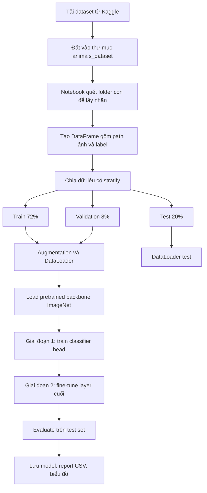

# 90 Animals Classification

## 1. Project này làm gì?

Đây là project phân loại ảnh RGB của **90 lớp động vật** bằng deep learning. Mục tiêu chính là xây dựng, huấn luyện, đánh giá và so sánh hai hướng **transfer learning** phổ biến trong computer vision:

- `ResNet-50`: mô hình CNN residual mạnh, ổn định, dễ dùng làm baseline.
- `EfficientNet-B3`: mô hình EfficientNet cân bằng giữa độ sâu, độ rộng và kích thước ảnh đầu vào.

Project được viết theo dạng notebook để người học có thể đi từ dữ liệu thô đến kết quả đánh giá cuối cùng mà không cần đọc nhiều file code rời rạc. Mỗi notebook có đủ các bước: quét dataset, chia dữ liệu, tạo DataLoader, build model pretrained, train trên GPU, đánh giá test set, lưu model và xuất biểu đồ.

## 2. Dataset sử dụng

Dataset sử dụng trong project là **Animal Image Dataset (90 Different Animals)** trên Kaggle:

https://www.kaggle.com/datasets/iamsouravbanerjee/animal-image-dataset-90-different-animals

Theo trang Kaggle của dataset, bộ dữ liệu có **5,400 ảnh** thuộc **90 category/class**. Trong bản dữ liệu đang dùng tại project này, mỗi class có đúng **60 ảnh**, nên dataset khá cân bằng và phù hợp để học bài toán multi-class image classification.

Thông tin tổng quan:

| Thuộc tính | Giá trị |
|---|---:|
| Tổng số ảnh | 5,400 |
| Tổng số class | 90 |
| Số ảnh mỗi class | 60 |
| Kiểu ảnh | RGB image |
| Cấu trúc dữ liệu | mỗi class là một folder con |
| Bài toán | phân loại ảnh vào 1 trong 90 nhãn |

Dataset **không được push lên GitHub** để repo gọn hơn và tôn trọng cách phân phối dữ liệu qua Kaggle. Khi muốn chạy lại notebook, hãy tải dataset từ Kaggle rồi đặt thư mục `animals_dataset` vào project.

## 3. Cấu trúc dataset

Sau khi tải và giải nén, dataset cần có cấu trúc như sau:

```text
90-Animals-Classification/
├─ animals_dataset/
│  ├─ antelope/
│  ├─ badger/
│  ├─ bat/
│  ├─ ...
│  └─ zebra/
```

Tên folder con chính là tên nhãn. Notebook sẽ tự đọc tên folder để tạo danh sách class, vì vậy không cần viết nhãn thủ công.

<details>
<summary>Danh sách 90 nhãn</summary>

`antelope`, `badger`, `bat`, `bear`, `bee`, `beetle`, `bison`, `boar`, `butterfly`, `cat`, `caterpillar`, `chimpanzee`, `cockroach`, `cow`, `coyote`, `crab`, `crow`, `deer`, `dog`, `dolphin`, `donkey`, `dragonfly`, `duck`, `eagle`, `elephant`, `flamingo`, `fly`, `fox`, `goat`, `goldfish`, `goose`, `gorilla`, `grasshopper`, `hamster`, `hare`, `hedgehog`, `hippopotamus`, `hornbill`, `horse`, `hummingbird`, `hyena`, `jellyfish`, `kangaroo`, `koala`, `ladybugs`, `leopard`, `lion`, `lizard`, `lobster`, `mosquito`, `moth`, `mouse`, `octopus`, `okapi`, `orangutan`, `otter`, `owl`, `ox`, `oyster`, `panda`, `parrot`, `pelecaniformes`, `penguin`, `pig`, `pigeon`, `porcupine`, `possum`, `raccoon`, `rat`, `reindeer`, `rhinoceros`, `sandpiper`, `seahorse`, `seal`, `shark`, `sheep`, `snake`, `sparrow`, `squid`, `squirrel`, `starfish`, `swan`, `tiger`, `turkey`, `turtle`, `whale`, `wolf`, `wombat`, `woodpecker`, `zebra`.

</details>

## 4. Workflow tổng quát



Tỉ lệ chia dữ liệu thực tế:

| Split | Số ảnh | Tỉ lệ |
|---|---:|---:|
| Train | 3,888 | 72% |
| Validation | 432 | 8% |
| Test | 1,080 | 20% |

Notebook dùng `stratify` khi chia dữ liệu, nên mỗi split giữ phân bố lớp cân bằng nhất có thể.

## 5. Hai model trong project

| Model | Notebook | Input size | Pretrained weights | Fine-tune | Test accuracy | Macro F1 |
|---|---|---:|---|---|---:|---:|
| ResNet-50 | `ResNet-50/animals_ResNet.ipynb` | 224x224 | ImageNet-1K V2 | `layer4` | 93.70% | 93.45% |
| EfficientNet-B3 | `EfficientNet-B3/animals_EfficientNetB3.ipynb` | 300x300 | ImageNet-1K V1 | `last_stage` | 93.98% | 93.89% |

Kết quả trên được lấy từ các file `classification_report.csv` đã lưu trong từng thư mục output. Vì quá trình train có augmentation và GPU có thể khác nhau, kết quả khi chạy lại có thể dao động nhẹ.

## 6. Cấu trúc project trên GitHub

```text
90-Animals-Classification/
├─ README.md
├─ .gitignore
├─ ResNet-50/
│  ├─ README.md
│  ├─ QUICK_START.md
│  ├─ animals_ResNet.ipynb
│  └─ resnet50_outputs/
│     ├─ animals_resnet50_final.pth
│     ├─ animals_resnet50_history.csv
│     ├─ animals_resnet50_classification_report.csv
│     └─ *.png
└─ EfficientNet-B3/
   ├─ README.md
   ├─ QUICK_START.md
   ├─ animals_EfficientNetB3.ipynb
   └─ efficientnetb3_outputs/
      ├─ animals_efficientnet_b3_final.pth
      ├─ animals_efficientnet_b3_history.csv
      ├─ animals_efficientnet_b3_classification_report.csv
      └─ *.png
```

Thư mục `animals_dataset/` không nằm trong repo. Người chạy project cần tự tải dataset từ Kaggle.

## 7. Mỗi notebook gồm những phần nào?

Hai notebook được thiết kế cùng một cấu trúc để dễ so sánh:

1. Thiết lập môi trường, import thư viện và kiểm tra CUDA GPU.
2. Khai báo đường dẫn, batch size, số epoch và tham số train.
3. Quét dataset, thống kê số ảnh, số class và phân phối class.
4. Chia dữ liệu thành train, validation và test.
5. Tạo transform, augmentation, custom Dataset và DataLoader.
6. Load model pretrained từ ImageNet và thay classifier cuối thành 90 class.
7. Train 2 giai đoạn: train head trước, fine-tune layer cuối sau.
8. Đánh giá trên test set bằng accuracy, precision, recall, macro F1 và weighted F1.
9. Vẽ biểu đồ training curve, confusion matrix, class yếu nhất, cặp nhầm lẫn nhiều nhất.
10. Lưu model, label mapping, config và report.

## 8. Vì sao dùng transfer learning?

Dataset này có 5,400 ảnh cho 90 class, trung bình 60 ảnh mỗi class. Nếu train một CNN lớn từ đầu, mô hình phải tự học mọi đặc trưng thị giác như cạnh, texture, hình dạng, bộ phận cơ thể, màu sắc và bối cảnh chỉ từ lượng dữ liệu khá nhỏ. Điều này thường làm train lâu hơn và dễ overfit.

Transfer learning giúp tận dụng backbone đã học trước trên ImageNet. Backbone đã biết nhiều đặc trưng ảnh tổng quát, còn project này chỉ cần điều chỉnh phần classifier và fine-tune layer cuối để thích nghi với 90 class của dataset.

## 9. Kết quả đầu ra cần đọc như thế nào?

Mỗi folder model có một thư mục output riêng. Những file quan trọng nhất:

| File | Ý nghĩa |
|---|---|
| `*_final.pth` | trọng số model cuối cùng |
| `*_history.csv` | loss, accuracy, F1 theo từng epoch |
| `*_classification_report.csv` | precision, recall, F1, support của 90 class |
| `*_training_curves.png` | đường cong train/validation |
| `*_metric_overview.png` | tổng quan score trên test set |
| `*_confusion_matrix.png` | ma trận nhầm lẫn tuyệt đối |
| `*_confusion_matrix_normalized.png` | ma trận nhầm lẫn chuẩn hóa |
| `*_worst_classes.png` | 15 class có F1 thấp nhất |
| `*_top_confusions.png` | 15 cặp class bị nhầm nhiều nhất |
| `*_correct_predictions.png` | ví dụ dự đoán đúng |
| `*_incorrect_predictions.png` | ví dụ dự đoán sai |

## 10. Nhánh GitHub

Repo này được đẩy lên GitHub theo hai nhánh chính:

- `ResNet-50`: chứa tài liệu và folder model ResNet-50.
- `EfficientNet-B3`: chứa tài liệu và folder model EfficientNet-B3.

Mỗi nhánh tập trung vào một model để người đọc có thể clone đúng phần mình muốn học hoặc chạy thử.

