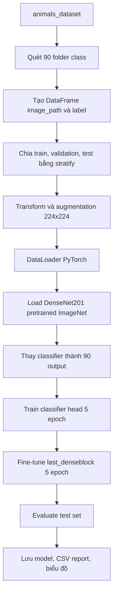

# DenseNet201 Animal Classification

## 1. Mục tiêu của folder này

Folder này chứa notebook, model đã huấn luyện, báo cáo và hình ảnh đánh giá cho hướng **DenseNet201 pretrained** trên bài toán phân loại ảnh RGB của 90 class động vật.

File trung tâm là:

```text
animals_DenseNet201.ipynb
```

Notebook được viết trọn vẹn trong một file để người mới có thể chạy theo thứ tự từ trên xuống: đọc dataset, build model, train GPU, đánh giá và lưu kết quả.

## 2. DenseNet201 là gì trong project này?

DenseNet là họ CNN dùng cơ chế **dense connection**: mỗi layer nhận feature từ nhiều layer trước đó. Cách nối dày đặc này giúp feature được tái sử dụng tốt hơn, gradient truyền ổn định hơn và mô hình có thể học đặc trưng ảnh hiệu quả.

Trong project này, notebook dùng pretrained weights:

```python
DenseNet201_Weights.IMAGENET1K_V1
```

Classifier cuối của DenseNet201 được thay bằng head mới để dự đoán 90 class của dataset.

## 3. Workflow của notebook



## 4. Cấu hình chính

| Thành phần | Giá trị |
|---|---:|
| Backbone | DenseNet201 |
| Pretrained weights | ImageNet-1K V1 |
| Framework | PyTorch + TorchVision |
| Input size | 224x224 |
| Batch size | 128 |
| Tổng epoch | 10 |
| Train head | 5 epoch |
| Fine-tune | 5 epoch |
| Layer mở khi fine-tune | `last_denseblock` |
| Optimizer | AdamW |
| Loss | CrossEntropyLoss |
| GPU | CUDA, ví dụ NVIDIA RTX A3000 12GB |

## 5. Chia dữ liệu

Dataset có 5,400 ảnh và 90 class. Notebook chia dữ liệu như sau:

| Split | Số ảnh | Tỉ lệ |
|---|---:|---:|
| Train | 3,888 | 72% |
| Validation | 432 | 8% |
| Test | 1,080 | 20% |

Việc chia dữ liệu dùng `stratify`, nên các class được giữ cân bằng giữa train, validation và test.

## 6. Chiến lược train

Notebook train theo hai giai đoạn:

**Giai đoạn 1: train classifier head**

Backbone DenseNet201 được đóng băng. Notebook chỉ train classifier mới thêm vào để học mapping từ feature ImageNet sang 90 nhãn của dataset.

**Giai đoạn 2: fine-tune `last_denseblock`**

Notebook mở dense block cuối của DenseNet201 và tiếp tục train với learning rate nhỏ hơn. Mục đích là tinh chỉnh feature cấp cao cho dataset animals nhưng vẫn giữ lại phần lớn kiến thức ImageNet.

## 7. Kết quả đã lưu

Kết quả hiện có trong `densenet201_outputs/`:

| Metric | Giá trị |
|---|---:|
| Test accuracy | 93.61% |
| Macro precision | 94.13% |
| Macro recall | 93.61% |
| Macro F1 | 93.59% |
| Test samples | 1,080 |

Các file quan trọng:

| File | Mục đích |
|---|---|
| `animals_densenet201_final.pth` | trọng số model cuối cùng |
| `animals_densenet201_config.json` | cấu hình train |
| `animals_densenet201_labels.json` | mapping nhãn |
| `animals_densenet201_history.csv` | log theo epoch |
| `animals_densenet201_classification_report.csv` | report 90 class |
| `animals_densenet201_training_curves.png` | biểu đồ loss, accuracy, F1 |
| `animals_densenet201_confusion_matrix.png` | confusion matrix |
| `animals_densenet201_confusion_matrix_normalized.png` | confusion matrix chuẩn hóa |
| `animals_densenet201_worst_classes.png` | 15 class có F1 thấp nhất |
| `animals_densenet201_top_confusions.png` | 15 cặp nhầm lẫn nhiều nhất |
| `animals_densenet201_correct_predictions.png` | ví dụ dự đoán đúng |
| `animals_densenet201_incorrect_predictions.png` | ví dụ dự đoán sai |

## 8. Cách đọc kết quả

`accuracy` cho biết tỉ lệ ảnh test dự đoán đúng.

`macro F1` cho biết model có học đều trên 90 class hay không. Đây là chỉ số quan trọng vì dataset có nhiều class và một số class có thể dễ bị nhầm do hình dạng hoặc bối cảnh gần nhau.

`confusion matrix` giúp xem class nào bị nhầm sang class nào.

`top_confusions.png` chỉ vẽ 15 cặp nhầm nhiều nhất để biểu đồ dễ đọc, còn bảng text trong notebook có thể in toàn bộ các cặp bị nhầm.

## 9. Khi nào nên dùng DenseNet201?

DenseNet201 phù hợp khi muốn thử một CNN pretrained có cơ chế tái sử dụng feature mạnh và dễ so sánh với ResNet/EfficientNet. So với ResNet-50, DenseNet201 có cách truyền feature khác nên rất hữu ích cho mục tiêu học kiến trúc CNN. Điểm cần chú ý là model vẫn khá nặng, nên nếu GPU hết VRAM thì giảm `BATCH_SIZE` trước.
